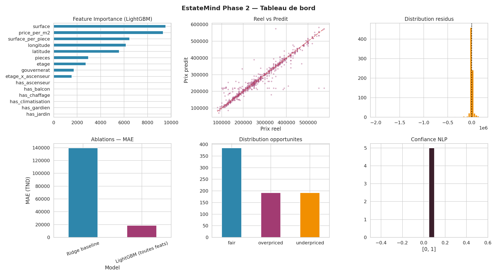
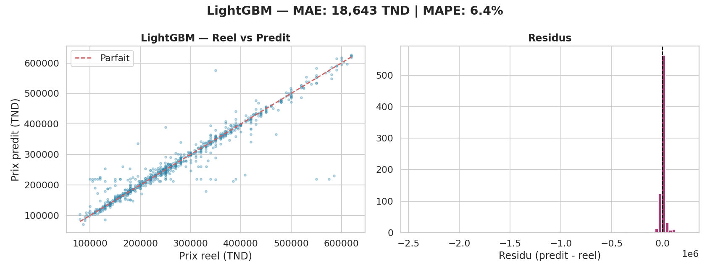
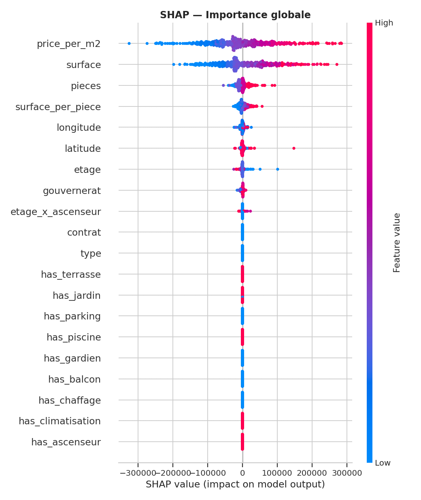
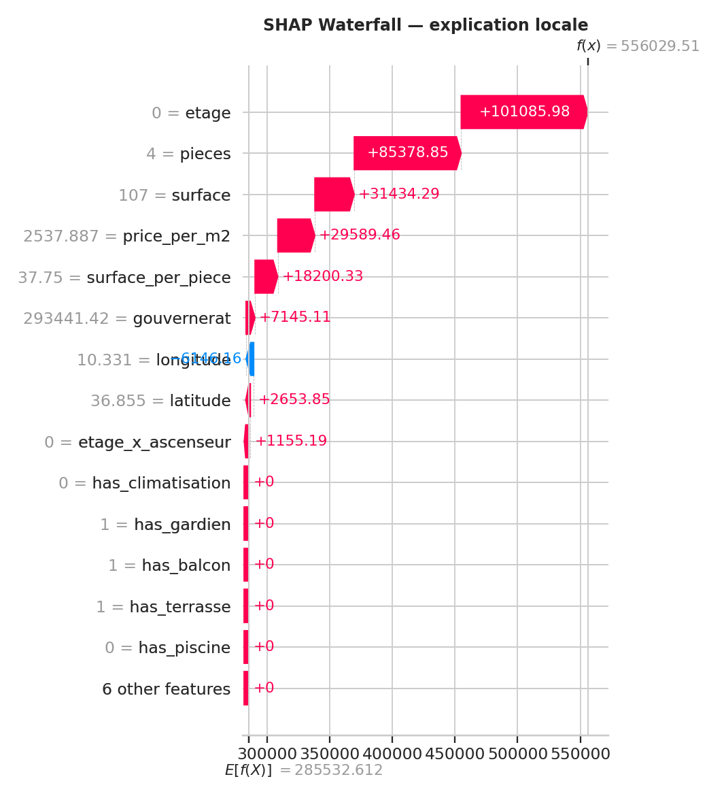
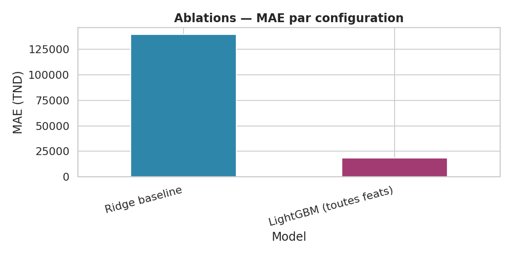

# 🏠 EstateMind — AI-Powered Real Estate Intelligence Platform

EstateMind is an **AI-powered real estate intelligence platform** designed for the Tunisian market.  
The platform helps users explore real estate listings, understand market prices, detect anomalies, receive intelligent recommendations, analyze market trends, and understand legal contract terms in a simple way.

This project was developed as part of the **Data Science program at ESPRIT** in collaboration with **Value Tunisie**.

---

## 📌 Project Description

The Tunisian real estate market contains many listings from different regions and sources.  
However, the information is often incomplete, unstructured, duplicated, or difficult to compare.

EstateMind solves this problem by combining:

- Artificial Intelligence
- Machine Learning
- Data Engineering
- Recommendation Systems
- Real Estate Market Analysis
- Legal Assistance
- Web Technologies

The goal is to make real estate decisions more transparent, intelligent, and data-driven.

---

## 🎬 Demo Videos & Documents

All demo files and documents are placed inside the `video/` folder.

```txt
EstateMind/
├── README.md
└── video/
    ├── vid_commercial.mp4
    ├── demoESTATEMIND.mp4
    ├── EstateMind_Rapport.pdf
    └── soutenance PI.pptx
```

🎬 Demo Videos & Project Documents

All demo videos and project documents are hosted on Google Drive to keep the GitHub repository lightweight and easy to clone.

📁 Google Drive Folder:
Open EstateMind Demo Videos & Documents

🎥 Commercial Video

The commercial video presents the main idea of EstateMind, the problem addressed, and the value of using AI for real estate transparency.

▶ Watch the commercial video

🎥 Full Platform Demo

The full demo video shows the main features of the platform, including listings, AI recommendation, market intelligence, price prediction, anomaly detection, and legal assistance.

▶ Watch the full platform demo

📄 Project Report

The project report contains the full technical and functional documentation of EstateMind.

📖 Read the project report

📊 Defense Presentation

The defense presentation summarizes the project context, architecture, features, AI agents, results, and future improvements.

📖 View the defense presentation
---

## 🤖 AI Agents

EstateMind includes more than **6 specialized AI agents** working together inside one platform.

| AI Agent | Description |
|---|---|
| 📸 AI Captioner | Analyzes property photos and automatically generates professional real estate descriptions. |
| 🔄 ETL Pipeline | Collects, cleans, transforms, and structures thousands of real estate listings from Tunisia. |
| 📈 Price Prediction | Estimates the fair market value of a property using machine learning models. |
| ⚠️ Anomaly Detection | Detects listings that are suspiciously cheap, overpriced, or inconsistent with the market. |
| ⚖️ Legal Agent | Explains Tunisian real estate law, contract clauses, and legal risks in simple language. |
| 🗺️ Market Intelligence | Displays regional market trends, price evolution, and geographic insights. |
| 🎯 AI Recommendation Agent | Understands user needs and recommends the most relevant properties. |

---

## 🧠 Main Features

### 🏘️ Real Estate Listings

- Display real estate listings.
- View listing details.
- Filter listings by price, region, type, and other criteria.
- Search properties easily.

### 🔍 Intelligent Search

- Search by text or filters.
- Use sidebar filters.
- Sort results.
- Navigate between pages using pagination.

### 🎯 AI Recommendation

- Understands natural language queries.
- Extracts user needs.
- Applies progressive fallback filtering.
- Ranks the best properties.
- Gives explainable results.

### 📈 Price Prediction

- Predicts the estimated market price of a property.
- Helps users know if a property is fairly priced.
- Supports better real estate decisions.

### ⚠️ Anomaly Detection

- Detects abnormal listings.
- Finds properties that are too cheap or too expensive compared to the market.
- Helps identify suspicious listings.

### 🗺️ Market Intelligence

- Analyzes price evolution by region.
- Shows market trends.
- Helps users understand where the market is moving.

### ⚖️ Legal Assistant

- Helps users understand real estate contracts.
- Explains legal terms in simple language.
- Supports Tunisian real estate law understanding.

### 📸 AI Captioner

- Generates property descriptions from images.
- Helps create professional real estate listings.
- Saves time for agents and sellers.

### 🔄 ETL Pipeline

- Collects raw real estate data.
- Cleans and transforms data.
- Structures listings for analytics and machine learning.

---

## 🏗️ Global Project Architecture

The project is organized into several main folders.

```txt
EstateMind/
├── backend/
├── estatemind-site/
├── frontend/
├── member1/
├── web/
├── video/
└── README.md
```

| Folder | Role |
|---|---|
| `backend/` | Node.js / Express backend API, controllers, services, routes, and Python scripts. |
| `estatemind-site/` | Next.js web application with authentication, listings, recommendation, map, and legal pages. |
| `frontend/` | React / Vite dashboard interface for analytics, listings, pipeline, scrapers, and maps. |
| `member1/` | Data science folder containing datasets, models, SHAP outputs, dashboards, and ML visualizations. |
| `web/` | Main Next.js platform with AI agents, Prisma, API routes, UI components, and Python services. |
| `video/` | Demo videos, project report, and defense presentation. |

---

## ⚙️ Backend Architecture

The `backend/` folder contains the server-side logic.

```txt
backend/
├── config/
│   ├── cache.js
│   └── database.js
│
├── controllers/
│   ├── listingsController.js
│   ├── mapController.js
│   ├── pipelineController.js
│   └── statsController.js
│
├── middleware/
│   ├── errorHandler.js
│   └── rateLimiter.js
│
├── routes/
│   ├── health.js
│   ├── listings.js
│   ├── map.js
│   ├── pipeline.js
│   └── stats.js
│
├── services/
│   ├── aiFlowService.js
│   ├── cacheService.js
│   └── socketService.js
│
├── import_data.py
├── main.py
├── requirements.txt
├── server.js
├── package.json
├── package-lock.json
└── .env.example
```

### Backend Responsibilities

- Manage real estate listing APIs.
- Provide statistics and analytics endpoints.
- Handle map-related data.
- Manage the ETL pipeline.
- Connect AI services with the platform.
- Handle errors using middleware.
- Apply rate limiting for security.
- Support socket services.
- Run Python scripts for data import and processing.

---

## 🌐 EstateMind Site Architecture

The `estatemind-site/` folder contains a Next.js application.

```txt
estatemind-site/
├── prisma/
│   └── schema.prisma
│
├── public/
│   ├── logo.png
│   └── logo-transparent.png
│
├── scripts/
│   ├── make-admin.mjs
│   └── remove-bg.mjs
│
├── src/
│   ├── app/
│   │   ├── api/
│   │   │   ├── agents/[agent]/[...path]/
│   │   │   ├── auth/
│   │   │   ├── chat/recommend/
│   │   │   ├── listings/
│   │   │   ├── translate/
│   │   │   └── upload/
│   │   │
│   │   ├── legal/
│   │   ├── listing/[id]/
│   │   ├── map/
│   │   ├── me/
│   │   ├── recommend/
│   │   ├── search/
│   │   ├── signin/
│   │   ├── signup/
│   │   ├── globals.css
│   │   ├── home-client.tsx
│   │   ├── layout.tsx
│   │   └── page.tsx
│   │
│   ├── components/
│   │   ├── lang-switcher.tsx
│   │   ├── legal-chat.tsx
│   │   ├── navbar.tsx
│   │   ├── providers.tsx
│   │   ├── recommend-widget.tsx
│   │   └── search-bar.tsx
│   │
│   ├── contexts/
│   │   └── lang.tsx
│   │
│   ├── hooks/
│   │   └── use-translate.ts
│   │
│   ├── lib/
│   │   ├── auth.ts
│   │   ├── i18n.ts
│   │   └── prisma.ts
│   │
│   └── types/
│       └── next-auth.d.ts
│
├── package.json
├── package-lock.json
├── next.config.ts
├── postcss.config.mjs
├── tsconfig.json
└── .gitignore
```

### EstateMind Site Responsibilities

- User authentication.
- Sign in and sign up pages.
- Listing details page.
- Search page.
- Recommendation page.
- Legal assistant page.
- Map page.
- User profile area.
- Language switching.
- Prisma database connection.
- API routes for agents, listings, uploads, and translation.

---

## 🖥️ React Frontend Architecture

The `frontend/` folder contains a React / Vite frontend.

```txt
frontend/
├── src/
│   ├── components/
│   │   ├── Layout/
│   │   └── LangSwitcher.jsx
│   │
│   ├── contexts/
│   │   └── LangContext.jsx
│   │
│   ├── lib/
│   │   └── i18n.js
│   │
│   ├── pages/
│   │   ├── Analytics.jsx
│   │   ├── Listings.jsx
│   │   ├── Login.jsx
│   │   ├── Overview.jsx
│   │   ├── Pipeline.jsx
│   │   ├── PowerBI.jsx
│   │   ├── Scrapers.jsx
│   │   └── TunisiaMap.jsx
│   │
│   ├── services/
│   │   └── api.js
│   │
│   ├── styles/
│   │   ├── index.css
│   │   └── theme.js
│   │
│   ├── App.jsx
│   └── main.jsx
│
├── index.html
├── package.json
├── package-lock.json
└── vite.config.js
```

### Frontend Responsibilities

- Display dashboards.
- Show real estate analytics.
- Display listings.
- Manage pipeline pages.
- Show scraper status.
- Display Tunisia map.
- Manage language context.
- Communicate with backend APIs.

---

## 🌍 Main Web Platform Architecture

The `web/` folder contains the main Next.js platform with AI agents and services.

```txt
web/
├── prisma/
│   └── schema.prisma
│
├── public/
│
├── src/
│   ├── app/
│   │   ├── [locale]/
│   │   ├── api/
│   │   ├── favicon.ico
│   │   └── globals.css
│   │
│   ├── components/
│   │   ├── auth/
│   │   ├── chat/
│   │   ├── listings/
│   │   ├── search/
│   │   ├── site/
│   │   └── ui/
│   │
│   ├── generated/
│   │   └── prisma/
│   │
│   ├── i18n/
│   ├── lib/
│   ├── types/
│   └── proxy.ts
│
├── AGENTS.md
├── CLAUDE.md
├── README.md
├── agents.config.json
├── api.py
├── app.py
├── pipeline.py
├── requirements.txt
├── requirements_api.txt
├── requirements_train.txt
├── Dockerfile
├── docker-compose.yml
├── package.json
├── package-lock.json
├── next.config.ts
├── tsconfig.json
└── postcss.config.mjs
```

### Web Platform Responsibilities

- Main user interface.
- AI chat widgets.
- Legal chat widget.
- Search widgets.
- Listing cards.
- Favorite listings.
- User menu.
- Contract analyzer.
- Coming soon page.
- Multilingual support.
- Prisma generated client.
- Python AI services.
- Docker deployment configuration.

---

## 📊 Data Science Folder

The `member1/` folder contains machine learning outputs, datasets, and visual results.

```txt
member1/
├── catboost_info/
├── estate-mind/
├── ablations.png
├── estatemind_dashboard.png
├── lgbm_predictions.png
├── shap_summary.png
├── shap_waterfall.png
├── structure.txt
└── tunisia_realestate_cleaned.csv
```

### Data Science Content

- Cleaned Tunisian real estate dataset.
- Model training outputs.
- CatBoost information.
- LightGBM prediction results.
- SHAP explainability charts.
- Ablation study visualizations.
- Dashboard screenshots.
- Data structure documentation.

---

## 📸 Visual Results

### EstateMind Dashboard



### LightGBM Predictions



### SHAP Summary



### SHAP Waterfall



### Ablation Study



---

## 🛠️ Technologies Used

### Frontend

- Next.js
- React.js
- TypeScript
- JavaScript
- Vite
- CSS
- Tailwind CSS
- Responsive UI components

### Backend

- Node.js
- Express.js
- REST API
- Middleware architecture
- Rate limiting
- Error handling
- Socket service

### Database & ORM

- Prisma ORM
- SQL database integration
- Prisma generated client

### Data Science & Machine Learning

- Python
- Pandas
- NumPy
- Scikit-learn
- CatBoost
- LightGBM
- SHAP
- Data cleaning
- Feature engineering
- Model evaluation
- Recommendation algorithms

### DevOps & Tools

- Docker
- Docker Compose
- Git
- GitHub
- Environment variables
- Modular architecture

---

## 🚀 Installation

### 1. Clone the Repository

```bash
git clone https://github.com/your-username/estate-mind.git
cd estate-mind
```

---

## ▶️ Run the Backend

```bash
cd backend
npm install
cp .env.example .env
npm run dev
```

If the project does not contain a `dev` script, run:

```bash
node server.js
```

---

## ▶️ Run EstateMind Site

```bash
cd estatemind-site
npm install
npx prisma generate
npm run dev
```

The application usually runs on:

```txt
http://localhost:3000
```

---

## ▶️ Run the React / Vite Frontend

```bash
cd frontend
npm install
npm run dev
```

The frontend usually runs on:

```txt
http://localhost:5173
```

---

## ▶️ Run the Main Web Platform

```bash
cd web
npm install
npx prisma generate
npm run dev
```

---

## 🐍 Run Python Services

Some AI services and data processing scripts are written in Python.

### Run Python API from `web/`

```bash
cd web
pip install -r requirements.txt
python app.py
```

### Run Python scripts from `backend/`

```bash
cd backend
pip install -r requirements.txt
python main.py
```

---

## 🐳 Docker

The project also contains Docker configuration.

```bash
cd web
docker-compose up --build
```

---

## 🔐 Environment Variables

Create a `.env` file based on `.env.example`.

Example:

```env
DATABASE_URL="your_database_url"
NEXTAUTH_SECRET="your_nextauth_secret"
NEXTAUTH_URL="http://localhost:3000"
BACKEND_URL="http://localhost:5000"
API_BASE_URL="http://localhost:5000"
```

You may need to add other variables depending on your local setup.

---

## 📂 Complete Repository Structure

```txt
EstateMind/
├── backend/
│   ├── config/
│   │   ├── cache.js
│   │   └── database.js
│   ├── controllers/
│   │   ├── listingsController.js
│   │   ├── mapController.js
│   │   ├── pipelineController.js
│   │   └── statsController.js
│   ├── middleware/
│   │   ├── errorHandler.js
│   │   └── rateLimiter.js
│   ├── routes/
│   │   ├── health.js
│   │   ├── listings.js
│   │   ├── map.js
│   │   ├── pipeline.js
│   │   └── stats.js
│   ├── services/
│   │   ├── aiFlowService.js
│   │   ├── cacheService.js
│   │   └── socketService.js
│   ├── import_data.py
│   ├── main.py
│   ├── requirements.txt
│   ├── server.js
│   ├── package.json
│   └── package-lock.json
│
├── estatemind-site/
│   ├── prisma/
│   │   └── schema.prisma
│   ├── public/
│   ├── scripts/
│   ├── src/
│   │   ├── app/
│   │   ├── components/
│   │   ├── contexts/
│   │   ├── generated/
│   │   ├── hooks/
│   │   ├── lib/
│   │   └── types/
│   ├── package.json
│   ├── package-lock.json
│   ├── next.config.ts
│   ├── postcss.config.mjs
│   └── tsconfig.json
│
├── frontend/
│   ├── src/
│   │   ├── components/
│   │   ├── contexts/
│   │   ├── lib/
│   │   ├── pages/
│   │   ├── services/
│   │   └── styles/
│   ├── index.html
│   ├── package.json
│   ├── package-lock.json
│   └── vite.config.js
│
├── member1/
│   ├── catboost_info/
│   ├── estate-mind/
│   ├── ablations.png
│   ├── estatemind_dashboard.png
│   ├── lgbm_predictions.png
│   ├── shap_summary.png
│   ├── shap_waterfall.png
│   ├── structure.txt
│   └── tunisia_realestate_cleaned.csv
│
├── web/
│   ├── prisma/
│   ├── public/
│   ├── src/
│   │   ├── app/
│   │   ├── components/
│   │   ├── generated/
│   │   ├── i18n/
│   │   ├── lib/
│   │   └── types/
│   ├── AGENTS.md
│   ├── CLAUDE.md
│   ├── README.md
│   ├── agents.config.json
│   ├── api.py
│   ├── app.py
│   ├── pipeline.py
│   ├── requirements.txt
│   ├── requirements_api.txt
│   ├── requirements_train.txt
│   ├── Dockerfile
│   ├── docker-compose.yml
│   ├── package.json
│   ├── package-lock.json
│   └── next.config.ts
│
├── video/
│   ├── vid_commercial.mp4
│   ├── demoESTATEMIND.mp4
│   ├── EstateMind_Rapport.pdf
│   └── soutenance PI.pptx
│
└── README.md
```

---

## 👥 Team Members

This project was built by:

- Wael Ben Salem
- Farah Ben Yedder
- Hjaij Sirine
- Zakaria Bouchaddakh
- Mohamed Abdennadher
- Aziz Hamlaoui

---

## 🙏 Acknowledgements

Special thanks to:

- Mrs. Sarra Zouari
- Mrs. Islem Maiti
- Value Tunisie
- ESPRIT

Thank you for your guidance, support, and mentorship throughout this project.

---

## 📌 Academic Context

EstateMind was developed as an integrated project in Data Science and Artificial Intelligence.

The project demonstrates how AI can improve real estate transparency in emerging markets by combining:

- Real-world data collection
- Machine learning
- Recommendation systems
- Explainable AI
- Legal assistance
- Market intelligence
- Web development

---

## 🔮 Future Improvements

Possible future improvements include:

- Add more real estate data sources.
- Improve property image understanding.
- Add advanced geospatial analysis.
- Add user preference history.
- Improve legal document analysis.
- Add real-time market alerts.
- Deploy the full platform online.
- Add mobile application support.

---

## 📄 License

This project was developed for academic purposes as part of the Data Science program at ESPRIT.

---

## ⭐ Final Note

EstateMind is more than a real estate platform.  
It is an AI-powered decision-support system designed to make the Tunisian real estate market more transparent, intelligent, and accessible.
